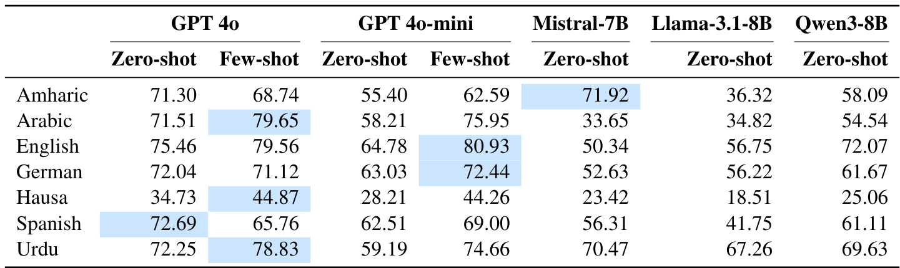

# Subtask 1

Subtask1 Page: https://www.codabench.org/competitions/10522/

The idea is to discern whether a given statement is poloarizing or not, making it a binary classification task. Our focus will be on the "English" and "Arabic" languages. Both the training and testing datasets are given, and can be found in the `data` folder.

## Papers

### 01: "POLAR: A Benchmark for Multilingual, Multicultural, and Multi-Event Online Polarization"

Soruce: https://arxiv.org/pdf/2505.20624

This paper benchmarkes the performance of multiple models (both MLMs and LLMs) for each of the subtasks, both in monolingual and multilingual settings. 

Below is the results of the of the various MLMs for this given subtask (Polrization Subtask), based on the average F1 score:

And here are the results for the LLMs:

