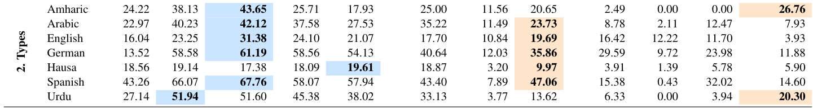

# Subtask 2

Subtask2 Page: https://www.codabench.org/competitions/10669/

In this subtask, the model must determine the type of the polarization of the statement. The foucs will again be on "Enlgish" and "Arabic", and the datasets are given in the `data` folder (also given from the subtask page). 

## Papers

### 01: "POLAR: A Benchmark for Multilingual, Multicultural, and Multi-Event Online Polarization"

Soruce: https://arxiv.org/pdf/2505.20624

This paper benchmarkes the performance of multiple models for each of the subtasks, both in monolingual and multilingual settings. Below is the results of the of the various models for this given subtask (Types Subtask), based on the average F1 score:

