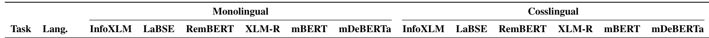
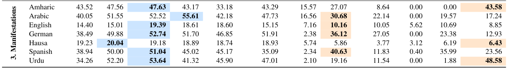

# Subtask 3

Subtask2 Page: https://www.codabench.org/competitions/10674/

In subtask 3, the goal is to determine the manifestation type of the poloarizing statement. The datasets are given in the `data` folder for the "English" and "Arabic" languages.

## Papers

### 01: "POLAR: A Benchmark for Multilingual, Multicultural, and Multi-Event Online Polarization"

Soruce: https://arxiv.org/pdf/2505.20624

This paper benchmarkes the performance of multiple models for each of the subtasks, both in monolingual and multilingual settings. Below is the results of the of the various models for this given subtask (Manifestation Subtask), based on the average F1 score:

